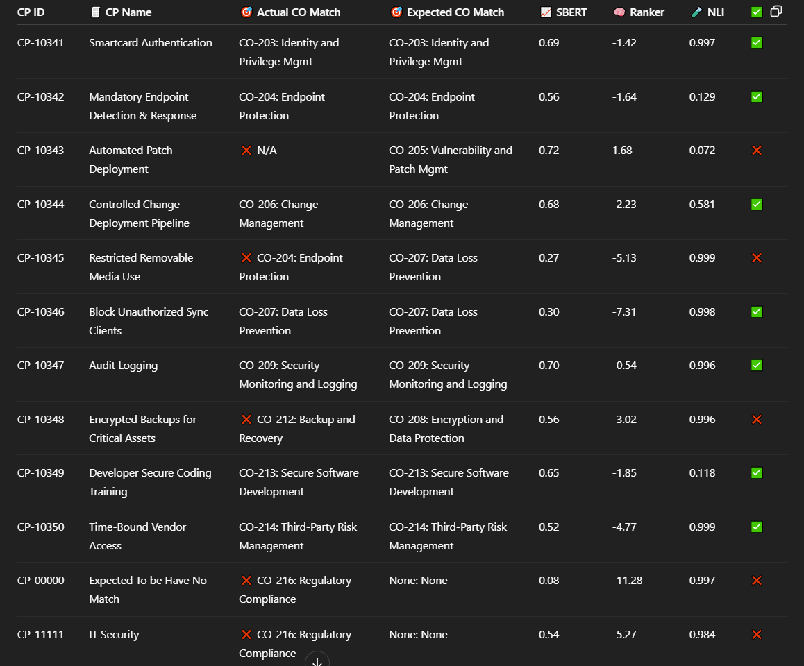

# 🧪 poc-text-categorizer

A proof-of-concept (PoC) pipeline using **SBERT** for retrieval, **Cross-Encoder Re-ranking**, and **Cross-Encoder NLI** to automatically **categorize unstructured text elements** into well-defined categories.

📌 This demo focuses on a **GRC (Governance, Risk, and Compliance)** scenario — classifying **Control Procedures (CPs)** into the correct **Control Objectives (COs)**.

---

## 🧠 Pipeline Overview

1. **SBERT Similarity Retrieval**  
   Fast cosine similarity to shortlist top-5 candidates.

2. **Cross-Encoder Re-Ranker**  
   Refines ranking with pairwise semantic understanding.

3. **Cross-Encoder NLI Check**  
   Final layer checks whether the CP _entails_ the CO using an NLI model.

---

## 🖼️ Sample Output

